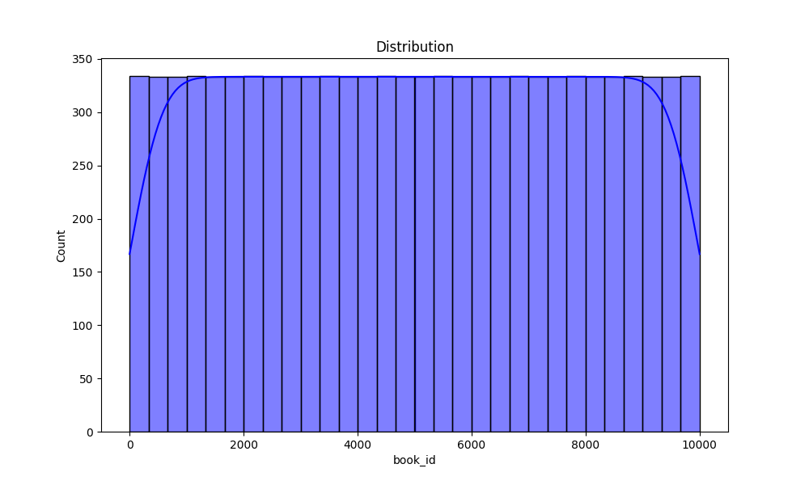

# Automated Data Analysis Report

## Summary Statistics

| Statistic | book_id | goodreads_book_id | ... | ratings_4 | ratings_5 |
| --- | --- | --- | ... | --- | --- |
| count | 10000.0 | 1.000000e+04 | ... | 1.000000e+04 | 1.000000e+04 |
| mean | 5000.5 | 5.264697e+06 | ... | 1.996570e+04 | 2.378981e+04 |
| std | 2886.9 | 7.575462e+06 | ... | 5.144736e+04 | 7.976889e+04 |
| min | 1.0 | 1.000000e+00 | ... | 7.500000e+02 | 7.540000e+02 |
| 25% | 2500.75 | 4.627575e+04 | ... | 5.405750e+03 | 5.334000e+03 |
| 50% | 5000.5 | 3.949655e+05 | ... | 8.269500e+03 | 8.836000e+03 |
| 75% | 7500.25 | 9.382225e+06 | ... | 1.602350e+04 | 1.730450e+04 |
| max | 10000.0 | 3.328864e+07 | ... | 1.481305e+06 | 3.011543e+06 |
[8 rows x 16 columns]

## Missing Values

| Column Name | Missing Values Count |
| --- | --- |
| book_id | 0 |
| goodreads_book_id | 0 |
| best_book_id | 0 |
| work_id | 0 |
| books_count | 0 |
| isbn | 700 |
| isbn13 | 585 |
| authors | 0 |
| original_publication_year | 21 |
| original_title | 585 |
| title | 0 |
| language_code | 1084 |
| average_rating | 0 |
| ratings_count | 0 |
| work_ratings_count | 0 |
| work_text_reviews_count | 0 |
| ratings_1 | 0 |
| ratings_2 | 0 |
| ratings_3 | 0 |
| ratings_4 | 0 |
| ratings_5 | 0 |
| image_url | 0 |
| small_image_url | 0 |

## Outliers Detection

| Column Name | Outliers Count |
| --- | --- |
| book_id | 0 |
| goodreads_book_id | 345 |
| best_book_id | 357 |
| work_id | 601 |
| books_count | 844 |
| isbn13 | 556 |
| original_publication_year | 1031 |
| average_rating | 158 |
| ratings_count | 1163 |
| work_ratings_count | 1143 |
| work_text_reviews_count | 1005 |
| ratings_1 | 1140 |
| ratings_2 | 1156 |
| ratings_3 | 1149 |
| ratings_4 | 1131 |
| ratings_5 | 1158 |

## Correlation Matrix
Below is the correlation matrix of numerical features:

## Outliers Visualization
Below is the outliers detection chart:

## Distribution
Below is the distribution plot :

## Story
### The Tale of the Bookshelf: A Journey Through Data

Once upon a time in a quaint little library nestled between the bustling streets of a vibrant city, there lay a bookshelf brimming with stories waiting to be discovered. This bookshelf was not just a collection of books; it was a treasure trove of narratives, emotions, and knowledge. Each book had its own tale to tell, reflected not only in its pages but also in the numbers that narrated its journey through the eyes of countless readers. Our story begins with a meticulous examination of this literary trove, a journey guided by the magic of data analysis.

As the librarian, Miss Elara, dusted off the spines of the books, she began to notice patterns in the way readers interacted with them. Each book was assigned a unique identity � a book_id, a goodreads_book_id, and a best_book_id, which served as beacons to navigate through the vast ocean of literature. The data revealed a world where ratings were as varied as the colors in a sunset. With over 10,000 books cataloged, the average rating hovered around a promising score, but the true story lay within the numbers that illustrated the readers� sentiments. 

The statistics painted a vivid picture: while some books received the love of thousands, others were languishing in obscurity with just a few ratings. The mean ratings for three, four, and five stars showcased a tapestry of reader experiences, with five-star ratings often correlating with the books that had captured hearts and sparked imaginations. Yet, among the glittering stars, Miss Elara noticed a peculiar trend � a significant number of books had garnered a surprising amount of three-star ratings, hinting at a world of stories that might have been good but not great. What could these tales be missing? 

Peering deeper into the dataset, Miss Elara unearthed the outliers � a few books that stood apart from the rest. These anomalies, with their hefty ratings and a plethora of reviews, were like gems in the rough. Yet, they also raised questions: How did they capture such attention? Were they truly extraordinary, or were they simply riding the coattails of a trend? The librarian pondered the implications of these findings, recognizing that the landscape of literature was a reflection of societal interests and moods. 

Transitioning from the numbers to the narratives, Elara began to consider the significance of missing values in the dataset. For instance, the absence of certain ISBNs and original publication years hinted at forgotten tales, perhaps stories that had faded from memory or were lost in the annals of time. What adventures could these missing pieces have held? This contemplation led her to understand that every book, whether celebrated or neglected, had a story worth exploring. Each rating, each review, was a thread in the complex fabric of literary appreciation.

As the sun set over the library, casting a golden hue upon the shelves, Miss Elara concluded her analysis. The data revealed that while some books shone brightly, others lingered in the shadows, waiting for their moment to shine. She recognized the potential outcomes of her findings: by understanding reader preferences and perceptions, she could curate a selection that balanced the well-loved classics with hidden gems yearning for attention. 

In this journey through data, the numbers had unveiled a narrative as rich and diverse as the books themselves. Miss Elara understood that behind every rating was a reader�s experience, a connection made through words. She resolved to celebrate both the popular and the obscure, knowing that in doing so, she would honor the true spirit of storytelling. And so, with a heart full of inspiration and a mind brimming with ideas, she set to work, ready to breathe new life into the stories that filled her beloved library. 

Thus, the journey through the data came to an end, but the stories continued to unfold, waiting patiently for their next reader. In the end, it was not just about numbers, but about the endless possibilities that each book held, ready to ignite imaginations and forge connections across time and space.
