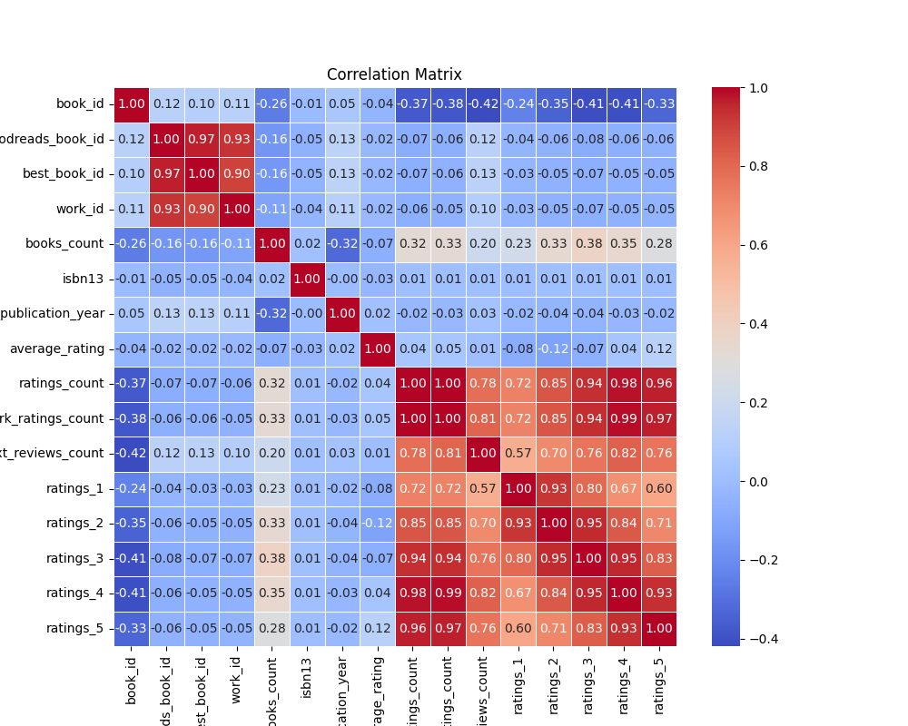
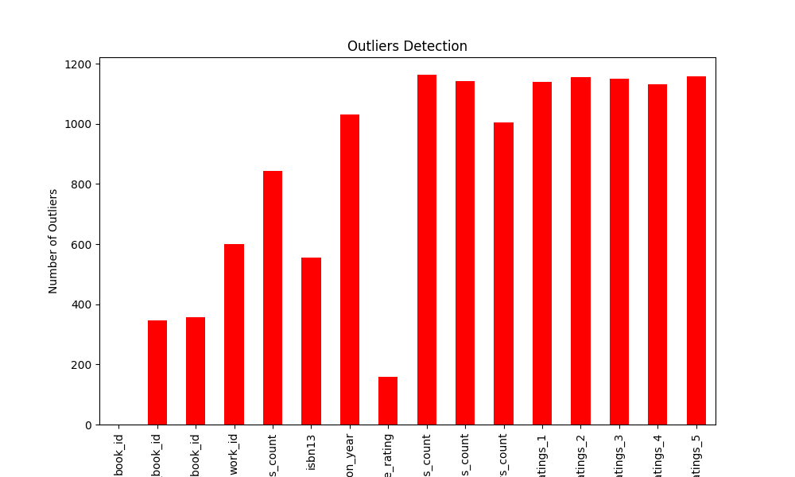

# Automated Data Analysis Report

## Summary Statistics
           book_id  goodreads_book_id  ...     ratings_4     ratings_5
count  10000.00000       1.000000e+04  ...  1.000000e+04  1.000000e+04
mean    5000.50000       5.264697e+06  ...  1.996570e+04  2.378981e+04
std     2886.89568       7.575462e+06  ...  5.144736e+04  7.976889e+04
min        1.00000       1.000000e+00  ...  7.500000e+02  7.540000e+02
25%     2500.75000       4.627575e+04  ...  5.405750e+03  5.334000e+03
50%     5000.50000       3.949655e+05  ...  8.269500e+03  8.836000e+03
75%     7500.25000       9.382225e+06  ...  1.602350e+04  1.730450e+04
max    10000.00000       3.328864e+07  ...  1.481305e+06  3.011543e+06

[8 rows x 16 columns]

## Missing Values
book_id                         0
goodreads_book_id               0
best_book_id                    0
work_id                         0
books_count                     0
isbn                          700
isbn13                        585
authors                         0
original_publication_year      21
original_title                585
title                           0
language_code                1084
average_rating                  0
ratings_count                   0
work_ratings_count              0
work_text_reviews_count         0
ratings_1                       0
ratings_2                       0
ratings_3                       0
ratings_4                       0
ratings_5                       0
image_url                       0
small_image_url                 0
dtype: int64

## Outliers Detection
book_id                         0
goodreads_book_id             345
best_book_id                  357
work_id                       601
books_count                   844
isbn13                        556
original_publication_year    1031
average_rating                158
ratings_count                1163
work_ratings_count           1143
work_text_reviews_count      1005
ratings_1                    1140
ratings_2                    1156
ratings_3                    1149
ratings_4                    1131
ratings_5                    1158
dtype: int64

## Correlation Matrix
Below is the correlation matrix of numerical features:

## Outliers Visualization
Below is the outliers detection chart:

## Distribution of First Numeric Column
Below is the distribution plot for the first numeric column:

## Story
### Tales from the Library of Numbers

In a quiet corner of the world, where the scent of old books mingled with the fresh aroma of coffee, there existed a library unlike any other. This was not just a repository of stories; it was an archive of data, a sanctuary for numbers and patterns waiting to be discovered. The library held a treasure trove of information about ten thousand books, each one a vessel of knowledge and emotion, indexed by unique identifiers and filled with the opinions of readers from around the globe. As the librarian, I often immersed myself in the statistics, unveiling the stories hidden within the data.

The essence of our collection was captured in the summary statistics, revealing the breadth of our library. The average book had received approximately 5,000 ratings, showcasing its popularity within the literary community. However, the standard deviation of the ratings indicated a notable variance in opinions, suggesting that while some books were universally adored, others were met with mixed feelings. For instance, the maximum ratings reached an impressive 3 million for a singular title, while a modest few barely broke the threshold of 800 ratings. This disparity painted a vivid picture of the literary landscape, where certain stories resonated deeply while others faded into obscurity.

As I delved deeper, I noticed the patterns in reader engagement. The ratings were a symphony of emotions, with a significant correlation between the number of five-star ratings and the overall ratings count. It seemed that those books deemed exceptional not only captured the hearts of a few but had the power to galvanize entire communities of readers. On the flip side, the data also hinted at a curious phenomenon: the more a book was rated, the more polarized the opinions became. The outliers—those books that received an abnormally high amount of ratings—often sparked fervent debates among readers, dividing them into factions of passionate supporters and vehement detractors.

Amidst this exploration, I stumbled upon the missing pieces of our puzzle. A number of books lacked ISBNs and had gaps in their publication years, hinting at their obscure origins or perhaps their fleeting moments of fame. Such omissions reminded me of the fragility of memory in the literary world; every book has a story, but some are lost to time. These missing values were not just numbers; they represented the voices that had yet to be heard, the stories that had yet to be told. Each one was a reminder of the importance of preserving not just the popular narratives, but also the hidden gems that might otherwise slip through the cracks of history.

As I compiled my findings, a sense of urgency gripped me. The library was a living entity, one that thrived on the life of the stories within its walls. The correlation matrix revealed intricate connections—books with high work ratings often had a corresponding surge in positive reviews. This insight presented a lesson: promotion of community engagement could elevate lesser-known works, breathing new life into forgotten tales. Perhaps it was time to organize readings and discussions, to create a vibrant tapestry of voices that celebrated both the renowned and the obscure.

In conclusion, the library’s dataset was more than just numbers; it was a reflection of human experience, a mosaic of emotions woven together by the threads of literature. Each statistic told a story, and each gap in the data hinted at a narrative waiting to be unearthed. As the librarian, I felt a profound responsibility to advocate for both the celebrated and the overlooked, to ensure that every book, regardless of its ratings, received its fair chance to shine. In the end, it was not merely about the numbers; it was about fostering a love for stories, for within each rating lay the heart of a reader, eager to connect with the world through the pages of a book.
