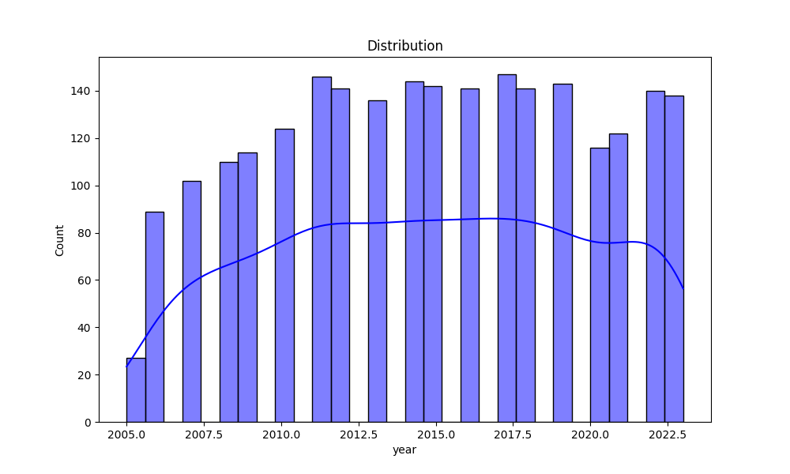

# Automated Data Analysis Report

## Summary Statistics
              year  Life Ladder  Log GDP per capita  ...  Perceptions of corruption  Positive affect  Negative affect
count  2363.000000  2363.000000         2335.000000  ...                2238.000000      2339.000000      2347.000000
mean   2014.763860     5.483566            9.399671  ...                   0.743971         0.651882         0.273151
std       5.059436     1.125522            1.152069  ...                   0.184865         0.106240         0.087131
min    2005.000000     1.281000            5.527000  ...                   0.035000         0.179000         0.083000
25%    2011.000000     4.647000            8.506500  ...                   0.687000         0.572000         0.209000
50%    2015.000000     5.449000            9.503000  ...                   0.798500         0.663000         0.262000
75%    2019.000000     6.323500           10.392500  ...                   0.867750         0.737000         0.326000
max    2023.000000     8.019000           11.676000  ...                   0.983000         0.884000         0.705000

[8 rows x 10 columns]

## Missing Values
Country name                          0
year                                  0
Life Ladder                           0
Log GDP per capita                   28
Social support                       13
Healthy life expectancy at birth     63
Freedom to make life choices         36
Generosity                           81
Perceptions of corruption           125
Positive affect                      24
Negative affect                      16
dtype: int64

## Outliers Detection
year                                  0
Life Ladder                           2
Log GDP per capita                    1
Social support                       48
Healthy life expectancy at birth     20
Freedom to make life choices         16
Generosity                           39
Perceptions of corruption           194
Positive affect                       9
Negative affect                      31
dtype: int64

## Correlation Matrix
Below is the correlation matrix of numerical features:

## Outliers Visualization
Below is the outliers detection chart:

## Distribution
Below is the distribution plot :

## Story
**The Tale of the Life Ladder: Ascending Through Numbers**

**Introduction**

In a world increasingly defined by data, where numbers often speak louder than words, the quest for happiness and well-being has become a focal point of societal progress. The "Life Ladder" is a metaphorical tool, a scale that measures how individuals perceive their lives relative to their expectations and aspirations. As we delve into a dataset spanning nearly two decades, we uncover the intricate tapestry woven from the threads of economics, social support, and personal well-being. This story will explore how these factors intertwine and influence our collective journey toward fulfillment.

**Body**

The first step on our ascent begins with the year itself, a timeline stretching from 2005 to 2023, capturing the fluctuations of the human experience. As we climb the rungs of the Life Ladder, we notice an average score of 5.48, a number that suggests a moderate sense of well-being among the global population. Yet, beneath this average lies a rich landscape of variance; the standard deviation of 1.12 indicates that while some people look down from heights of profound happiness, others dwell in the shadows of discontent. 

Key to this journey is the Log GDP per capita, which serves as a beacon of economic vitality. With a robust correlation of 0.78 to the Life Ladder, it becomes clear that prosperity significantly influences happiness. The average Log GDP per capita stands at 9.40, a figure that reflects the wealth available to individuals, yet the highs and lows—ranging from 5.53 to 11.68—reveal stark disparities. The data indicates that as economies flourish, so too do the spirits of their citizens. However, we must not overlook the outliers, the singular tales of those who defy the odds, achieving happiness despite economic challenges. 

Social support emerges as another vital component in this quest for joy. With a correlation of 0.72 to the Life Ladder, its significance cannot be overstated. The average score of social support highlights the importance of community and relationships in shaping our well-being. Yet, here too, we find missing values and outliers that tell stories of isolation or unexpected connections. As we traverse this landscape, we realize that our connections to others can lift us higher on the Life Ladder, or, conversely, leave us stranded on lower rungs.

Freedom to make life choices, another rungs on our ladder, holds a correlation of 0.54 with happiness, reinforcing the notion that autonomy feeds our sense of fulfillment. Yet, the data reveals that a lack of freedom can constrict potential, leading to feelings of despair. The average score of freedom, combined with perceptions of corruption, paints a complex picture; while some societies thrive with perceived integrity, others grapple with distrust and its corrosive effects on happiness.

As we ascend further, we encounter the emotional climbers—positive and negative affect. The data shows a strong positive correlation (0.51) between life satisfaction and positive emotions, while negative emotions (with a correlation of -0.35) act as anchors, pulling some back down the ladder. Here, we learn that the human experience is multifaceted; joy and sorrow exist in tandem, shaping our perceptions of life and happiness.

**Conclusion**

As we reach the summit of our analysis, we reflect on the insights gleaned from this rich dataset. The journey up the Life Ladder is influenced by myriad factors, from economic prosperity to social connections and personal freedom. While the average scores suggest a moderate level of happiness globally, the underlying disparities and correlations reveal a complex interplay of elements that define our existence.

Ultimately, the story of the Life Ladder teaches us that while numbers can quantify our experiences, they also remind us of the deeply personal nature of happiness. As we navigate the peaks and valleys of life, we are encouraged to cherish our connections, advocate for freedom, and strive for a world where everyone has the opportunity to ascend their own ladder. In this way, happiness is not merely a statistic; it is a shared journey, a collective aspiration, and an ongoing story we all contribute to.
