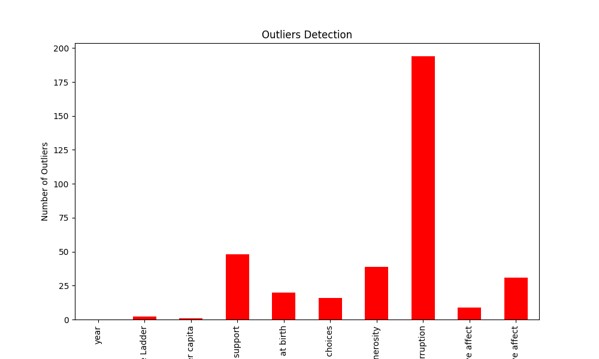

# Automated Data Analysis Report

## Summary Statistics
              year  Life Ladder  ...  Positive affect  Negative affect
count  2363.000000  2363.000000  ...      2339.000000      2347.000000
mean   2014.763860     5.483566  ...         0.651882         0.273151
std       5.059436     1.125522  ...         0.106240         0.087131
min    2005.000000     1.281000  ...         0.179000         0.083000
25%    2011.000000     4.647000  ...         0.572000         0.209000
50%    2015.000000     5.449000  ...         0.663000         0.262000
75%    2019.000000     6.323500  ...         0.737000         0.326000
max    2023.000000     8.019000  ...         0.884000         0.705000

[8 rows x 10 columns]

## Missing Values
Country name                          0
year                                  0
Life Ladder                           0
Log GDP per capita                   28
Social support                       13
Healthy life expectancy at birth     63
Freedom to make life choices         36
Generosity                           81
Perceptions of corruption           125
Positive affect                      24
Negative affect                      16
dtype: int64

## Outliers Detection
year                                  0
Life Ladder                           2
Log GDP per capita                    1
Social support                       48
Healthy life expectancy at birth     20
Freedom to make life choices         16
Generosity                           39
Perceptions of corruption           194
Positive affect                       9
Negative affect                      31
dtype: int64

## Correlation Matrix
Below is the correlation matrix of numerical features:

## Outliers Visualization
Below is the outliers detection chart:

## Distribution of First Numeric Column
Below is the distribution plot for the first numeric column:

## Story
### The Harmony of Happiness: A Journey Through Data

In a world that often seems divided by chaos and uncertainty, the quest for happiness remains a universal pursuit. From the bustling streets of metropolitan cities to the quiet corners of rural villages, the desire for a fulfilling life is a common thread that binds humanity together. This tale begins with a treasure trove of data—a dataset that reveals the intricate tapestry of global happiness, showcasing the Life Ladder, a metaphorical measure of well-being, and the emotional landscape of societies from 2005 to 2023. Through this dataset, we embark on a journey to uncover the underlying patterns and profound insights that emerge from the numbers, ultimately leading us to a greater understanding of what it means to live well.

As we delve into the dataset, we uncover a wealth of statistics that paint a vivid picture of happiness across the globe. The Life Ladder, with a mean score of 5.48, serves as a crucial indicator of average life satisfaction. However, the journey is not as straightforward as it seems. The standard deviation of 1.13 suggests that experiences of happiness vary dramatically within populations, revealing a spectrum where some individuals find themselves at the lower rungs of the ladder, while others soar to the heights of joy. This contrast is illustrated by the minimum score of 1.28 and the maximum of 8.02, suggesting that while some people struggle with despair, others bask in the glow of fulfillment.

Moreover, the analysis reveals intriguing correlations among various factors contributing to happiness. For instance, the positive affect—a measure of feelings such as joy and contentment—has a mean of 0.65, while negative affect, capturing feelings of sadness and anger, averages at 0.27. Fascinatingly, the data suggests a strong inverse relationship between positive and negative affect, as evidenced by a correlation coefficient of -0.33. This indicates that as positive emotions rise, negative feelings tend to diminish, underscoring the delicate balance of human emotion. The numbers remind us that happiness is not merely the absence of sadness but a complex interplay of various emotional experiences.

Peering deeper, we encounter the elusive factors that shape life satisfaction. Social support, a vital pillar in the architecture of well-being, shows a negative correlation with negative affect at -0.45. This suggests that communities offering robust support systems foster environments where individuals experience fewer negative emotions. However, as we navigate the data, we also uncover gaps—missing values in critical areas such as healthy life expectancy and perceptions of corruption, which hint at deeper societal issues that can impede happiness. These missing pieces challenge us to consider the multifaceted nature of well-being and the importance of addressing systemic inequalities that persist across nations.

As we journey through the years, we observe an upward trend in the Life Ladder, particularly from 2011 to 2019, suggesting a global shift towards greater happiness. Yet, the COVID-19 pandemic marked a turning point, as emerging data from 2020 onwards indicates fluctuations in happiness levels, possibly reflecting the profound impact of social isolation and economic uncertainty. The resilience of humanity is called into question, prompting us to explore how societies can adapt to ensure that happiness is not merely a fleeting moment but a sustained state of being.

In conclusion, our exploration of the dataset offers profound insights into the nature of happiness. It serves as a reminder that while numbers can quantify life satisfaction, they cannot fully encapsulate the human experience. The interplay of social support, emotional well-being, and systemic factors reveals a complex landscape where joy and sorrow coexist. As we move forward, it becomes imperative to nurture the elements that contribute to well-being, ensuring that future generations can climb their own Life Ladders with confidence and hope. Ultimately, this journey through data not only informs us about the past but also inspires us to forge a path toward a brighter, more harmonious future—a world where happiness is within reach for all.
