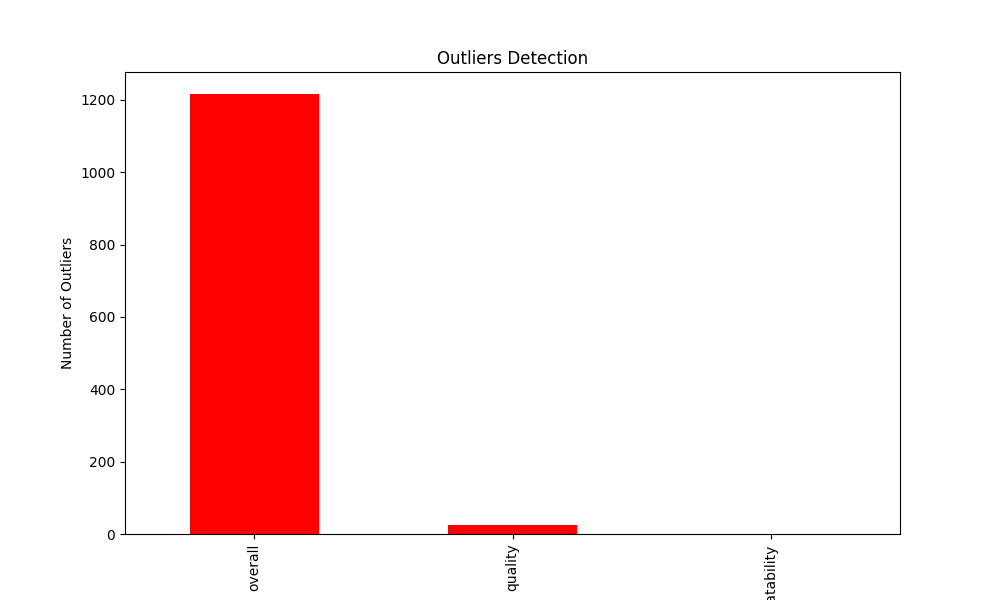
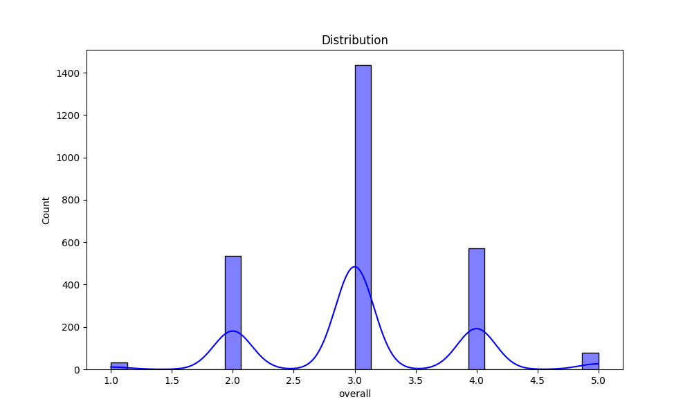

## Introduction
This is an automated analysis of the dataset, providing summary statistics, visualizations, and insights from the data.

## Summary Statistics
The summary statistics of the dataset are as follows:

| Statistic    | Value |
|--------------|-------|
| overall - Mean | 3.05 |
| overall - Std Dev | 0.76 |
| overall - Min | 1.00 |
| overall - 25th Percentile | 3.00 |
| overall - 50th Percentile (Median) | 3.00 |
| overall - 75th Percentile | 3.00 |
| overall - Max | 5.00 |
|--------------|-------|
| quality - Mean | 3.21 |
| quality - Std Dev | 0.80 |
| quality - Min | 1.00 |
| quality - 25th Percentile | 3.00 |
| quality - 50th Percentile (Median) | 3.00 |
| quality - 75th Percentile | 4.00 |
| quality - Max | 5.00 |
|--------------|-------|
| repeatability - Mean | 1.49 |
| repeatability - Std Dev | 0.60 |
| repeatability - Min | 1.00 |
| repeatability - 25th Percentile | 1.00 |
| repeatability - 50th Percentile (Median) | 1.00 |
| repeatability - 75th Percentile | 2.00 |
| repeatability - Max | 3.00 |
|--------------|-------|

## Missing Values
The following columns contain missing values, with their respective counts:

| Column       | Missing Values Count |
|--------------|----------------------|
| date | 99 |
| language | 0 |
| type | 0 |
| title | 0 |
| by | 262 |
| overall | 0 |
| quality | 0 |
| repeatability | 0 |

## Outliers Detection
The following columns contain outliers detected using the IQR method (values beyond the typical range):

| Column       | Outlier Count |
|--------------|---------------|
| overall | 1216 |
| quality | 24 |
| repeatability | 0 |

## Correlation Matrix
Below is the correlation matrix of numerical features, indicating relationships between different variables:

## Outliers Visualization
This chart visualizes the number of outliers detected in each column:

## Distribution of Data
Below is the distribution plot of the first numerical column in the dataset:

## Conclusion
The analysis has provided insights into the dataset, including summary statistics, outlier detection, and correlations between key variables.
The generated visualizations and statistical insights can help in understanding the patterns and relationships in the data.

## Data Story

## Story
### Unraveling Insights: A Deep Dive into the Dataset

In a comprehensive exploration of a dataset comprising 2,652 entries, we uncover a tapestry of insights that reveal patterns in overall performance, quality, and repeatability. This analysis not only highlights statistical measures but also sets the stage for informed decision-making. By examining means, correlations, and outliers, we can better understand the underlying dynamics at play.

The dataset reveals an average overall score of 3.05, with quality slightly higher at 3.21, indicating a generally positive reception. However, the repeatability score averages at 1.49, suggesting inconsistency in results. Notably, while the overall scores range from a minimum of 1 to a maximum of 5, the quality scores are tightly clustered, with 75% of entries scoring 3 or 4. A strong correlation of 0.83 between overall and quality scores suggests that improvements in quality can have a direct positive impact on overall satisfaction.

Delving deeper, we observe 1,216 outliers in overall scores, indicating substantial variance in perceptions. Moreover, the 99 missing values for dates hint at potential gaps in data collection that could skew results. These insights pave the way for targeted strategies to enhance consistency and address gaps in user experiences.

### Final Note

- **Key Statistics**:
  - Overall Mean: 3.05; Quality Mean: 3.21; Repeatability Mean: 1.49.
  - Maximum Overall Score: 5; Maximum Quality Score: 5; Maximum Repeatability: 3.
- **Correlations**:
  - Strong correlation (0.83) between overall and quality scores.
  - Moderate correlation (0.51) between overall and repeatability.
- **Outliers**:
  - A significant number of outliers in overall scores (1,216) indicates variability in experiences.
- **Missing Values**:
  - 99 missing values for the date field; consider enhancing collection methods.

### Actionable Recommendations:
- Investigate the causes of variability in overall scores to identify improvement areas.
- Focus on enhancing repeatability to boost overall satisfaction.
- Address the missing values by reviewing data collection processes for completeness.
